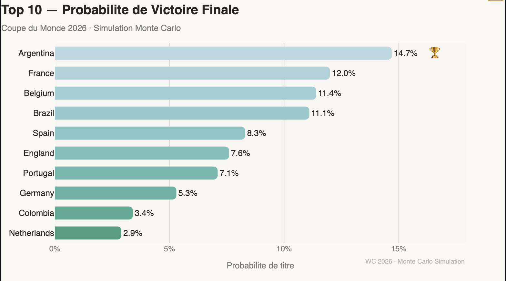
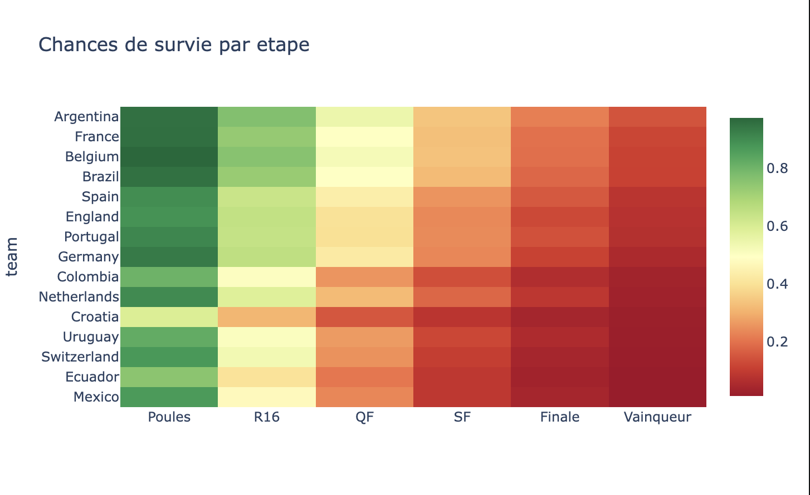

# WC 2026 ML Simulator


> **Research question:** Can a Monte Carlo simulator powered by ML models produce
> reliable, calibrated win probabilities for the 2026 FIFA World Cup?

## Overview

This project trains and compares four models on historical international match data,
then simulates the full WC 2026 tournament over 1,000 Monte Carlo iterations by default.
Features include Elo ratings, rolling form, FIFA rankings, and FBref squad statistics.

| Model                   | Type       | Architecture                                     |
| ----------------------- | ---------- | ------------------------------------------------ |
| **Champion XGBoost**    | Classifier | XGBoost + isotonic calibration (TimeSeriesSplit) |
| **Challenger Logistic** | Classifier | Multiclass Logistic Regression (scikit-learn)    |
| **Challenger LightGBM** | Classifier | LightGBM multiclass                              |
| **Challenger Poisson**  | Regressor  | Double Poisson regression (home / away goals)    |

Historical match results and FIFA rankings are provided as CSV files; player statistics
are fetched via **soccerdata / FBref**. The temporal split is:
train `< 2022-01-01`, validation `2022 – 2024`, test `>= 2024-01-01`.

## Feature Engineering

Each match is represented by a feature vector built from several sources:

- **Elo** — per-team Elo rating and differential (`elo_diff`)
- **Rolling form** — goals scored/conceded, win rate, clean sheet rate over the last N matches (N=8, decay=0.85)
- **FIFA** — rank, points, and differentials (`fifa_rank_diff`, `fifa_points_diff`)
- **Confederation** — membership and same-confederation indicator
- **Match context** — `match_importance` (1.0 group stage, 1.5 knockout), `days_rest`
- **FBref squad** — total minutes played, cumulative goals, G+A per 90 per national team
- **Noise filtering** — geography fields (`city`, `country`, `venue`) are excluded during training

## Project Structure

```text
src/
├── data_collection/ # International results loader, FBref scraper
├── features/ # Elo, rolling form, FBref aggregator, feature builder
├── models/ # Champion XGBoost, challengers LightGBM / Logistic / Poisson
├── evaluation/ # Classification metrics (accuracy, log-loss, Brier)
└── simulation/ # Monte Carlo tournament simulator
```

build_dataset.py # Full dataset pipeline (CLI entry point)
train_models.py # Train champion + challengers (CLI entry point)
evaluate.py # Evaluate on test split (CLI entry point)
simulate_wc2026.py # WC 2026 Monte Carlo simulation (CLI entry point)
Makefile # Full pipeline orchestration via make full

## Installation

Requires **Python >= 3.12**.

```bash
git clone https://github.com/ethanbch/wc2026-ml-simulator.git
cd wc2026-ml-simulator
```

**With [uv](https://docs.astral.sh/uv/)** (recommended):

```bash
uv sync
```

**With pip:**

```bash
python -m venv .venv && source .venv/bin/activate
pip install -r requirements.txt
```

## Reproducing the Results

Run the steps below **in order**. All hyperparameters are configurable via CLI arguments
or directly in the `Makefile` (including `N_SIMULATIONS`).

> `make full` chains steps 2 through 5 automatically.

### 1. FBref Data (optional — enriches squad features)

Fetches player and squad statistics via soccerdata:

```bash
make fbref LEAGUES="Big 5 European Leagues Combined" SEASONS="2022-2024"
```

### 2. Dataset Construction

Loads international results, computes Elo ratings, rolling form features, and squad
aggregates, then exports the match-level dataset:

```bash
python build_dataset.py \
  --international-results data/raw/international_results.csv \
  --fifa-rankings data/raw/fifa_rankings.csv \
  --squad-csv data/raw/squads.csv \
  --player-stats data/raw/fbref/player_standard.csv \
  --dataset-out data/processed/match_dataset.csv \
  --elo-out data/processed/elo_ratings.csv \
  --form-out data/processed/matches_with_form.csv \
  --team-features-out data/processed/national_team_features.csv
```

Or via Make:

```bash
make build-dataset
```

### 3. Model Training

Trains the XGBoost champion (with isotonic calibration over TimeSeriesSplit)
and all three challengers:

```bash
python train_models.py \
  --dataset data/processed/match_dataset.csv \
  --models-dir data/processed/models \
  --train-end 2022-01-01 \
  --val-end 2024-01-01
```

Add `--use-val` to include the validation period in final training.
Add `--no-calibration` to disable isotonic calibration on the champion.

```bash
make train
```

### 4. Evaluation

Evaluates all models on the test split and exports per-model confusion matrices:

```bash
python evaluate.py \
  --dataset data/processed/match_dataset.csv \
  --models-dir data/processed/models \
  --output data/processed/metrics.csv
```

```bash
make evaluate
```

### 5. WC 2026 Simulation

Runs Monte Carlo simulations of the full tournament, from group stage to final:

```bash
python simulate_wc2026.py \
  --model-path data/processed/models/champion_xgboost.pkl \
  --historical-matches data/raw/international_results.csv \
  --fifa-rankings data/raw/fifa_rankings.csv \
  --team-features data/processed/national_team_features.csv \
  --groups-csv data/raw/wc2026_groups.csv \
  --schedule-csv data/raw/wc2026_schedule.csv \
  --output data/processed/wc2026_simulation.csv \
  --n-simulations 1000
```

```bash
make simulate

# Override number of simulations
make simulate N_SIMULATIONS=100000
```

### Full Pipeline (One-shot)

```bash
make full
```

## Results

### Model Benchmark (Test Split, ≥ 2024-01-01)

| Model               | Accuracy | Log-Loss | Brier Score |
| ------------------- | -------: | -------: | ----------: |
| Champion XGBoost    |   57.58% |   0.9077 |      0.5363 |
| Challenger LightGBM |   56.54% |   0.9819 |      0.5641 |
| Challenger Logistic |   57.68% |   0.9014 |      0.5334 |
| Challenger Poisson  |   57.37% |   0.8945 |      0.5290 |

> Metrics are generated locally after `make evaluate` and saved to
> `data/processed/metrics.csv`. Run `make full` to populate your own benchmark.

Confusion matrices for each model are exported to `data/processed/plots/` as
`cm_<model_name>.png`.




### Key Findings

- **Temporal splitting** is critical in football match prediction: a random split would introduce data leakage through post-match Elo features.
- **Isotonic calibration** on the XGBoost champion significantly improves log-loss by aligning predicted probabilities with observed frequencies.
- The **double Poisson model** (home and away goals modelled separately) produces naturally interpretable probabilities via exact score → W/D/L mapping, but is more sensitive to missing features.
- **Decay-weighted rolling form** (decay=0.85 over 8 matches) is more informative than a simple window, capturing recent team momentum.
- **FBref squad features** (minutes played, G+A per 90) enhance the Poisson challenger but are optional for the classifier-based models.

## Future Work

- Incorporate bookmaker odds as an external feature.
- Hyperparameter tuning with Optuna and TimeSeriesSplit cross-validation.
- Add a penalty shootout model for knockout-stage tiebreakers.
- Interactive win probability dashboards per team (Plotly / Dash).
- Generalization to other tournaments (Euro, Copa América, AFCON).

## Output Files

All artifacts are saved under `data/processed/`:

| File                             | Content                                               |
| -------------------------------- | ----------------------------------------------------- |
| `match_dataset.csv`              | Match-level dataset with all engineered features      |
| `elo_ratings.csv`                | Full Elo rating history                               |
| `matches_with_form.csv`          | Dataset with rolling form features                    |
| `national_team_features.csv`     | Aggregated FBref features per national team           |
| `models/champion_xgboost.pkl`    | Calibrated XGBoost champion (joblib)                  |
| `models/challenger_logistic.pkl` | Logistic Regression challenger (joblib)               |
| `models/challenger_lightgbm.pkl` | LightGBM challenger (joblib)                          |
| `models/challenger_poisson.pkl`  | Poisson bundle (joblib)                               |
| `models/feature_columns.json`    | Ordered list of model feature columns                 |
| `models/label_classes.json`      | Target class ordering [W, D, L]                       |
| `metrics.csv`                    | Accuracy / Log-Loss / Brier per model on the test set |
| `wc2026_simulation.csv`          | Win probabilities per team over N simulations         |

Confusion matrix plots are saved in `data/processed/plots/`:

| File                         | Content                              |
| ---------------------------- | ------------------------------------ |
| `cm_champion_xgboost.png`    | Champion confusion matrix            |
| `cm_challenger_logistic.png` | Logistic Regression confusion matrix |
| `cm_challenger_lightgbm.png` | LightGBM confusion matrix            |
| `cm_challenger_poisson.png`  | Poisson challenger confusion matrix  |
